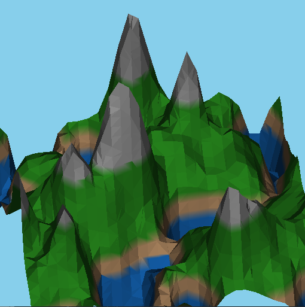
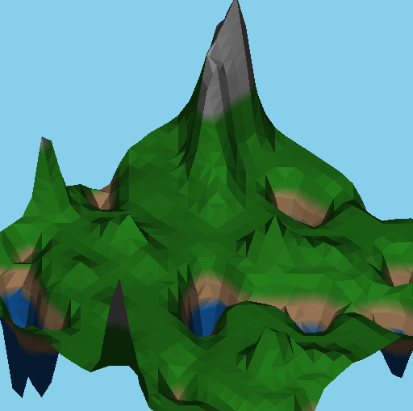
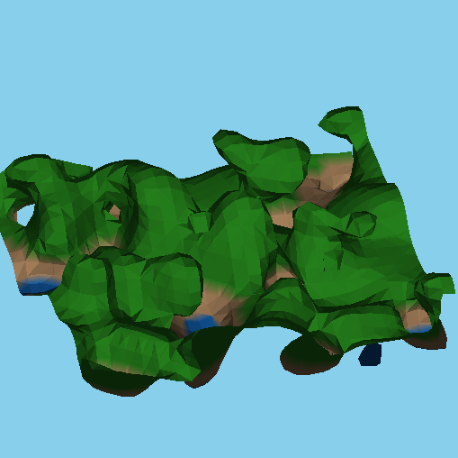
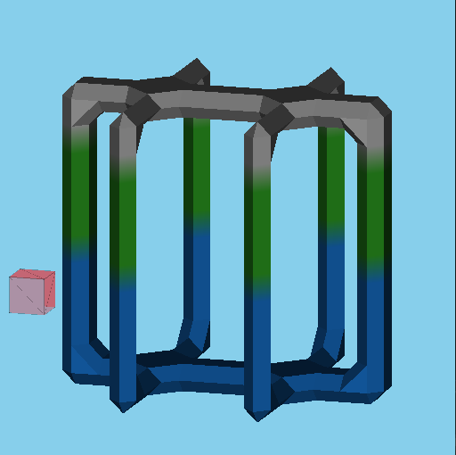

A procedural terrain generator and terrain editor built in C++ OpenGL using the Marching cubes algorithm and Perlin noise in 2D and 3D.

See COMP 4490 project report for algorithm details.

## Screenshots:

-----------------------------------------
### Procedural Terrain Generation:
-----------------------------------------

------------------------------------------
### Terrain Editor:
------------------------------------------

